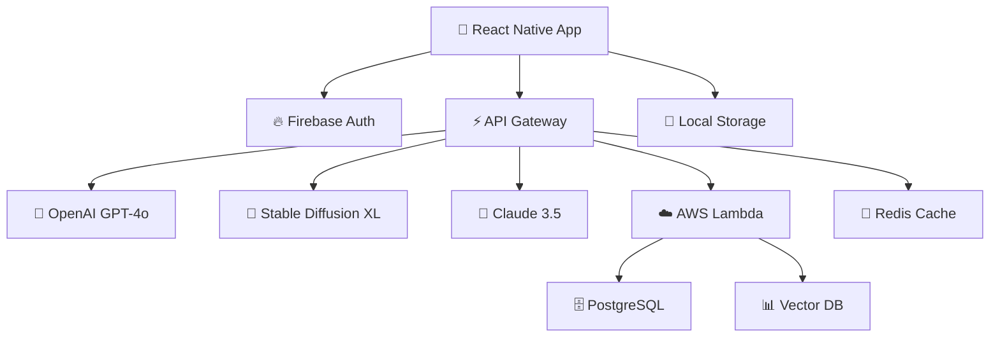

<div align="center">

# 🚀 MEMO-IMAGEN
### AI-Powered Visual Learning Revolution


[](https://github.com/umitkacar/MEMO-IMAGEN/stargazers)
[](LICENSE)
[](https://github.com/umitkacar/MEMO-IMAGEN/pulls)
[](https://reactnative.dev/)
[](https://openai.com)
[](https://aws.amazon.com/)
[](https://firebase.google.com/)

<p align="center">
  <a href="#-features">Features</a> •
  <a href="#-tech-stack">Tech Stack</a> •
  <a href="#-getting-started">Getting Started</a> •
  <a href="#-2024-2025-trending-resources">Trending Resources</a> •
  <a href="#-roadmap">Roadmap</a> •
  <a href="#-contributing">Contributing</a>
</p>

</div>

---

## 🎯 Overview

**MEMO-IMAGEN** is a cutting-edge AI-powered educational platform that revolutionizes language learning through **Computer Vision**, **Large Language Models (LLMs)**, and **Generative AI**. Built with modern technologies and powered by state-of-the-art AI models, this platform creates an immersive, visual learning experience.

<div align="center">

### 🌟 Why MEMO-IMAGEN?

| 🎨 Visual Learning | 🤖 AI-Powered | 📱 Cross-Platform | ⚡ Real-Time |
|:-------------------:|:-------------:|:-----------------:|:------------:|
| Stable Diffusion integration | GPT-4o & Claude 3.5 | React Native | Instant feedback |
| Image generation | Context-aware learning | iOS & Android | Live translation |
| Visual mnemonics | Personalized content | Web support | Dynamic exercises |

</div>

---

## ✨ Features

<table>
<tr>
<td width="50%">

### 🎨 **AI Image Generation**
- 🖼️ Text-to-image with Stable Diffusion XL
- 🎭 DALL-E 3 integration
- 🌈 Midjourney-style prompts
- 🎪 Custom visual mnemonics

</td>
<td width="50%">

### 🧠 **Advanced AI Models**
- 🤖 GPT-4o & GPT-4o-mini
- 🚀 Claude 3.5 Sonnet
- 🔮 Gemini 2.0 Flash
- 📊 Llama 3.3 70B

</td>
</tr>
<tr>
<td width="50%">

### 📱 **Mobile-First Design**
- 📲 React Native + Expo
- 🎯 Native performance
- 💾 Offline support
- 🔄 Real-time sync

</td>
<td width="50%">

### ☁️ **Cloud Infrastructure**
- ⚡ AWS Lambda & EC2
- 🔥 Firebase Realtime DB
- 🗄️ PostgreSQL + Vector DB
- 🚀 Edge computing

</td>
</tr>
</table>

---

## 🛠️ Tech Stack

<div align="center">

### **Frontend**


### **AI & ML**


### **Backend & Cloud**


### **Databases**


</div>

---

## 🚀 Getting Started

### Prerequisites

```bash
# Node.js 20+ and npm
node --version  # v20.0.0+
npm --version   # v10.0.0+

# Python 3.11+ for AI/ML components
python --version  # 3.11+

# Expo CLI
npm install -g expo-cli
```

### Installation

```bash
# Clone the repository
git clone https://github.com/umitkacar/MEMO-IMAGEN.git
cd MEMO-IMAGEN

# Install dependencies
npm install

# Set up environment variables
cp .env.example .env
# Edit .env with your API keys

# Start development server
npm start
```

### Environment Variables

```env
# OpenAI
OPENAI_API_KEY=sk-...

# Anthropic Claude
ANTHROPIC_API_KEY=sk-ant-...

# Stable Diffusion
STABILITY_API_KEY=sk-...

# AWS
AWS_ACCESS_KEY_ID=...
AWS_SECRET_ACCESS_KEY=...

# Firebase
FIREBASE_API_KEY=...
FIREBASE_PROJECT_ID=...
```

---

## 🌐 2024-2025 Trending Resources

<div align="center">

### 🏆 **Top AI/ML Repositories & Tools**

</div>

### 🤖 **Large Language Models**

| Repository | Stars | Description | Year |
|:-----------|:-----:|:------------|:----:|
| [🔥 **ChatGPT**](https://github.com/openai/openai-python) |  | Official OpenAI Python library | 2024 |
| [🚀 **Anthropic Claude**](https://github.com/anthropics/anthropic-sdk-python) |  | Claude 3.5 Sonnet SDK | 2024 |
| [⚡ **LLaMA 3.3**](https://github.com/meta-llama/llama) |  | Meta's open-source LLM | 2024 |
| [🎯 **Gemini**](https://github.com/google/generative-ai-python) |  | Google Gemini 2.0 API | 2024 |
| [🔮 **Mistral AI**](https://github.com/mistralai/mistral-inference) |  | Mistral 7B/8x7B models | 2024 |
| [💫 **DeepSeek**](https://github.com/deepseek-ai/DeepSeek-LLM) |  | DeepSeek-V3 reasoning model | 2025 |
| [🌟 **Qwen**](https://github.com/QwenLM/Qwen) |  | Alibaba's Qwen 2.5 | 2024 |

### 🎨 **Image Generation & Computer Vision**

| Repository | Stars | Description | Year |
|:-----------|:-----:|:------------|:----:|
| [🎭 **DALL-E 3**](https://platform.openai.com/docs/guides/images) | - | OpenAI's latest image model | 2024 |
| [🌈 **Stable Diffusion XL**](https://github.com/Stability-AI/generative-models) |  | SDXL & SD3 Turbo | 2024 |
| [🚀 **Flux**](https://github.com/black-forest-labs/flux) |  | Black Forest Labs Flux.1 | 2024 |
| [🎪 **Midjourney API**](https://github.com/erictik/midjourney-api) |  | Unofficial Midjourney API | 2024 |
| [🖼️ **ComfyUI**](https://github.com/comfyanonymous/ComfyUI) |  | Powerful SD workflow UI | 2024 |
| [🎯 **Fooocus**](https://github.com/lllyasviel/Fooocus) |  | Focus on prompting | 2024 |
| [🔥 **Recraft V3**](https://www.recraft.ai/) | - | State-of-the-art design AI | 2024 |

### 🛠️ **AI Development Frameworks**

| Repository | Stars | Description | Year |
|:-----------|:-----:|:------------|:----:|
| [⚡ **LangChain**](https://github.com/langchain-ai/langchain) |  | LLM application framework | 2024 |
| [🔗 **LlamaIndex**](https://github.com/run-llama/llama_index) |  | Data framework for LLMs | 2024 |
| [🎯 **Haystack**](https://github.com/deepset-ai/haystack) |  | NLP framework with LLMs | 2024 |
| [🚀 **AutoGen**](https://github.com/microsoft/autogen) |  | Multi-agent framework | 2024 |
| [🤖 **CrewAI**](https://github.com/joaomdmoura/crewAI) |  | Role-based AI agents | 2024 |
| [💡 **DSPy**](https://github.com/stanfordnlp/dspy) |  | Programming with LLMs | 2024 |

### 🎓 **Educational AI Projects**

| Repository | Stars | Description | Year |
|:-----------|:-----:|:------------|:----:|
| [📚 **GPT-4 Vision**](https://platform.openai.com/docs/guides/vision) | - | Multimodal AI capabilities | 2024 |
| [🎯 **OpenAI Cookbook**](https://github.com/openai/openai-cookbook) |  | OpenAI examples & guides | 2024 |
| [🔥 **LangChain Templates**](https://github.com/langchain-ai/langchain/tree/master/templates) | - | Production-ready templates | 2024 |
| [📖 **Prompt Engineering Guide**](https://github.com/dair-ai/Prompt-Engineering-Guide) |  | Comprehensive PE guide | 2024 |
| [🌟 **Awesome AI Tools**](https://github.com/ikaijua/Awesome-AITools) |  | Curated AI tools list | 2024 |

### 🌐 **Vector Databases & RAG**

| Repository | Stars | Description | Year |
|:-----------|:-----:|:------------|:----:|
| [📊 **Pinecone**](https://github.com/pinecone-io/pinecone-python-client) |  | Managed vector database | 2024 |
| [🔮 **Weaviate**](https://github.com/weaviate/weaviate) |  | Open-source vector DB | 2024 |
| [⚡ **Qdrant**](https://github.com/qdrant/qdrant) |  | High-performance vector DB | 2024 |
| [🚀 **Chroma**](https://github.com/chroma-core/chroma) |  | AI-native embedding DB | 2024 |
| [💫 **Milvus**](https://github.com/milvus-io/milvus) |  | Cloud-native vector DB | 2024 |

### 📱 **React Native & Mobile AI**

| Repository | Stars | Description | Year |
|:-----------|:-----:|:------------|:----:|
| [⚛️ **React Native**](https://github.com/facebook/react-native) |  | Latest RN 0.74+ | 2024 |
| [🎯 **Expo SDK 51**](https://github.com/expo/expo) |  | Universal native apps | 2024 |
| [🤖 **React Native AI**](https://github.com/dabit3/react-native-ai) |  | Full-stack AI framework | 2024 |
| [🔥 **Skia**](https://github.com/Shopify/react-native-skia) |  | High-performance graphics | 2024 |
| [🎨 **Reanimated 3**](https://github.com/software-mansion/react-native-reanimated) |  | Advanced animations | 2024 |

### 🎯 **Trending ML Models (2025)**

| Model | Provider | Capabilities | Release |
|:------|:---------|:-------------|:--------|
| 🚀 **GPT-4o** | OpenAI | Multimodal, real-time | 2024 |
| 🔥 **Claude 3.5 Sonnet** | Anthropic | 200K context, coding | 2024 |
| ⚡ **Gemini 2.0 Flash** | Google | Fast multimodal | 2024 |
| 🌟 **Llama 3.3 70B** | Meta | Open-source, powerful | 2024 |
| 💫 **DeepSeek-V3** | DeepSeek | Reasoning, math | 2025 |
| 🎯 **Qwen 2.5** | Alibaba | Multilingual excellence | 2024 |
| 🔮 **Mistral Large 2** | Mistral | 128K context | 2024 |

---

## 🏗️ Architecture

<div align="center">



</div>

---

## 👥 Team

### 🚀 Core Contributors

<table>
<tr>
<td align="center">
<h4>🧠 Senior ML Engineer</h4>
<p>Computer Vision & AI</p>
<ul align="left">
<li>✅ Stable Diffusion integration</li>
<li>✅ LLM orchestration</li>
<li>✅ Model fine-tuning</li>
<li>✅ AI pipeline optimization</li>
</ul>
</td>
<td align="center">
<h4>📱 Senior React Native Dev</h4>
<p>Mobile & Frontend</p>
<ul align="left">
<li>✅ Cross-platform development</li>
<li>✅ Native performance</li>
<li>✅ UI/UX excellence</li>
<li>✅ Real-time features</li>
</ul>
</td>
</tr>
</table>

---

## 📚 Key Resources

### 🔥 **OpenAI Resources**
- 📖 [Official Documentation](https://platform.openai.com/docs/overview)
- 🍳 [OpenAI Cookbook](https://github.com/openai/openai-cookbook/tree/main/examples)
- 🐍 [Python SDK](https://github.com/openai/openai-python/discussions/742)
- 🔑 [API Keys Management](https://platform.openai.com/api-keys)
- 🎯 [GPT-4o Vision Guide](https://platform.openai.com/docs/guides/vision)

### 🎨 **Stable Diffusion Resources**
- 🤗 [Hugging Face Space](https://huggingface.co/spaces/stabilityai/stable-diffusion)
- 📝 [Annotated Diffusion](https://huggingface.co/blog/annotated-diffusion)
- 🚀 [Diffusers Library](https://github.com/huggingface/diffusers)
- 🎓 [Training Tutorial](https://colab.research.google.com/github/huggingface/notebooks/blob/main/diffusers/training_example.ipynb)
- 🗄️ [LAION-5B Dataset](https://laion.ai/blog/laion-5b/)
- 🎯 [Stable Diffusion v1.5](https://huggingface.co/runwayml/stable-diffusion-v1-5)
- ⚡ [SDXL Turbo](https://huggingface.co/stabilityai/sdxl-turbo)

### 🛠️ **Development Resources**
- ⚛️ [React Native Docs](https://reactnative.dev/docs/getting-started)
- 📱 [Expo Documentation](https://docs.expo.dev/)
- 🔥 [Firebase Guides](https://firebase.google.com/docs)
- ☁️ [AWS AI Services](https://aws.amazon.com/machine-learning/)
- 🐍 [Pydantic Models](https://docs.pydantic.dev/latest/concepts/models/)

---

## 🗺️ Roadmap

<details>
<summary><b>✅ Phase 1: Foundation (Q4 2024) - COMPLETED</b></summary>

- [x] Project setup & architecture
- [x] React Native + Expo configuration
- [x] Firebase authentication
- [x] OpenAI GPT-4o integration
- [x] Basic UI components
- [x] Stable Diffusion setup

</details>

<details open>
<summary><b>🚧 Phase 2: Core Features (Q1 2025) - IN PROGRESS</b></summary>

- [x] Image generation with SDXL
- [x] Claude 3.5 Sonnet integration
- [ ] 🔄 Advanced prompt engineering
- [ ] 🔄 Vector database (Pinecone/Weaviate)
- [ ] 🔄 RAG implementation
- [ ] 🔄 Personalized learning paths
- [ ] 🔄 Real-time collaboration

</details>

<details>
<summary><b>🎯 Phase 3: Advanced AI (Q2 2025)</b></summary>

- [ ] Multi-modal learning experiences
- [ ] Voice integration (Whisper, ElevenLabs)
- [ ] Custom fine-tuned models
- [ ] AR/VR visualization
- [ ] Gamification system
- [ ] Social learning features
- [ ] Advanced analytics dashboard

</details>

<details>
<summary><b>🚀 Phase 4: Scale & Optimization (Q3 2025)</b></summary>

- [ ] Performance optimization
- [ ] Edge computing deployment
- [ ] Multi-language support (20+ languages)
- [ ] Enterprise features
- [ ] White-label solution
- [ ] Mobile app launch (App Store & Play Store)
- [ ] Marketing & growth

</details>

---

## 🎨 Screenshots & Demo

<div align="center">

### 🌟 Coming Soon!

_Beautiful UI screenshots and demo videos will be added here_


</div>

---

## 🤝 Contributing

We love contributions! Here's how you can help:

<div align="center">

### 🌟 Ways to Contribute

| 🐛 Bug Reports | ✨ Feature Requests | 📖 Documentation | 💻 Code |
|:-------------:|:-------------------:|:----------------:|:-------:|
| [Open Issue](https://github.com/umitkacar/MEMO-IMAGEN/issues) | [Suggest Feature](https://github.com/umitkacar/MEMO-IMAGEN/issues) | Improve docs | Submit PR |

</div>

### Development Workflow

```bash
# 1. Fork the repository
# 2. Clone your fork
git clone https://github.com/YOUR_USERNAME/MEMO-IMAGEN.git

# 3. Create a feature branch
git checkout -b feature/amazing-feature

# 4. Make your changes
# 5. Commit with conventional commits
git commit -m "feat: add amazing feature"

# 6. Push to your fork
git push origin feature/amazing-feature

# 7. Open a Pull Request
```

### 📜 Commit Convention

We follow [Conventional Commits](https://www.conventionalcommits.org/):

- `feat:` New features
- `fix:` Bug fixes
- `docs:` Documentation changes
- `style:` Code style changes
- `refactor:` Code refactoring
- `test:` Test additions/changes
- `chore:` Maintenance tasks

---

## 📄 License

This project is licensed under the **MIT License** - see the [LICENSE](LICENSE) file for details.

---

## 🌟 Star History

[](https://star-history.com/#umitkacar/MEMO-IMAGEN&Date)

---

## 💖 Support

If you find this project helpful, please consider:

- ⭐ Starring the repository
- 🐛 Reporting bugs
- 💡 Suggesting features
- 📢 Sharing with others

<div align="center">

### 🔗 Connect & Stay Updated

[](https://github.com/umitkacar)
[](https://twitter.com)
[](https://linkedin.com)

---

<p align="center">
  
</p>

**Made with ❤️ by the MEMO-IMAGEN Team** | **© 2024-2025**

</div>
